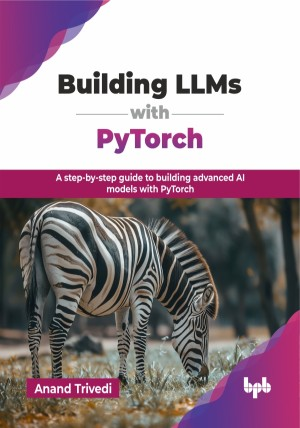

# Building LLMs with PyTorch

A step-by-step guide to building advanced AI models with PyTorch.

This is the repository for [Building LLMs with PyTorch
](https://bpbonline.com/products/building-llms-with-pytorch?variant=44527879323848),published by BPB Publications.

## About the Book
PyTorch has become the go-to framework for building cutting-edge large language models (LLMs), enabling developers to harness the power of deep learning for natural language processing. This book serves as your practical guide to navigating the intricacies of PyTorch, empowering you to create your own LLMs from the ground up. 

You will begin by mastering PyTorch fundamentals, including tensors, autograd, and model creation, before diving into core neural network concepts like gradients, loss functions, and backpropagation. Progressing through regression and image classification with convolutional neural networks, you will then explore advanced image processing through object detection and segmentation. The book seamlessly transitions into NLP, covering RNNs, LSTMs, and attention mechanisms, culminating in the construction of Transformer-based LLMs, including a practical mini-GPT project. You will also get a strong understanding of generative models like VAEs and GANs.

By the end of this book, you will possess the technical proficiency to build, train, and deploy sophisticated LLMs using PyTorch, equipping you to contribute to the rapidly evolving landscape of AI.

## What You Will Learn
• Build and train PyTorch models for linear and logistic regression.

• Configure PyTorch environments and utilize GPU acceleration with CUDA.

• Construct CNNs for image classification and apply transfer learning techniques.

• Master PyTorch tensors, autograd, and build fundamental neural networks.

• Utilize SSD and YOLO for object detection and perform image segmentation.

• Develop RNNs and LSTMs for sequence modeling and text generation.

• Implement attention mechanisms and build Transformer-based language models.

• Create generative models using VAEs and GANs for diverse applications.

• Build and deploy your own mini-GPT language model, applying the acquired skills.
